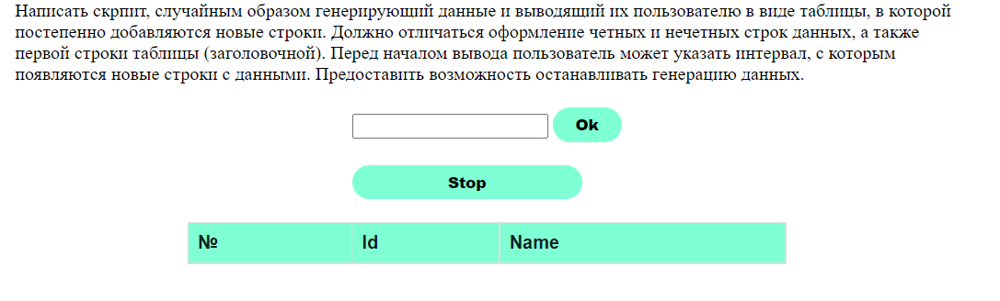
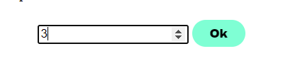
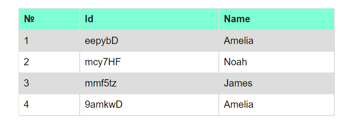

# Internet-технологии. Лабораторная работа №3. Язык создания сценариев JavaScript
### Вариант 4
КІУКІ-20-4 Ярослав Осьмуха

#### Головна сторінка

#### Текстове поле

#### Кнопка зупинки генерацію даних

#### Згенеравані дані

